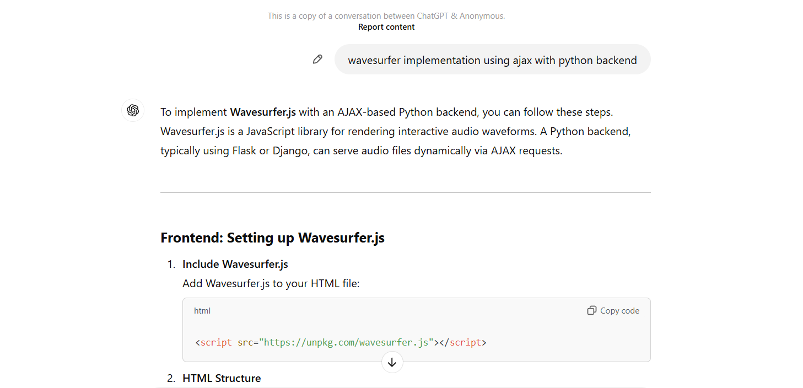
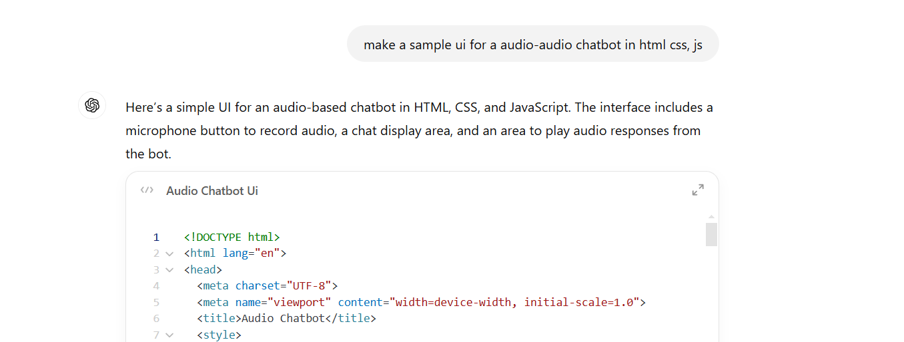

# User-centric Speech Tool
## ASR Chatbot with OpenAI Integration

A web-based chatbot application that combines speech recognition, text-to-speech, and natural language processing capabilities using OpenAI's APIs.

## Features

- 🎤 Real-time voice recording with visual waveform display
- 🔄 Speech-to-text transcription using OpenAI's Whisper model
- 💬 Natural language processing using GPT-3.5 Turbo
- 🔊 Text-to-speech response generation using OpenAI's TTS
- 📊 Visual audio waveform display using WaveSurfer.js
- 🤖 Intelligent conversation powered by GPT-3.5 Turbo
  - Natural language understanding and generation
  - Support for various topics and queries
  - Helpful and informative interactions
  - Multi-language support
  - Context-aware responses
  
## AI Assistance in Development

This project leverages AI not only in its core functionality but also in its development process:

- 🎨 Frontend Design
  - Initial CSS styling suggestions were generated using ChatGPT
  - Wave animation effects were refined with AI assistance
  - Color scheme recommendations were provided by AI
  
- 💻 Code Generation  
  - Basic HTML structure was scaffolded with AI help
  - JavaScript event handlers were initially drafted using AI
  - WaveSurfer.js integration was guided by AI suggestions

- 📝 Documentation
  - Parts of this README were enhanced using AI
  - Code comments and documentation strings were refined with AI assistance

While AI was instrumental in accelerating development, all code was reviewed, tested, and modified by human developers to ensure quality, security, and optimal performance. The AI served as a collaborative tool rather than a replacement for human expertise and judgment.

## Prerequisites
 
- Python 3.8+
- OpenAI API key
- Modern web browser with microphone support

## Installation

1. Clone the repository:
bash
git clone [your-repository-url]
cd [repository-name]

2. Install required Python packages:
pip install -r requirements.txt

3. Set your OpenAI API key:
export OPENAI_API_KEY='your_api_key_here'

4. Run the application:
uvicorn api.main:app --reload

2. Open your web browser and navigate to:
http://localhost:8000

## Project Structure

- `/api` - Backend FastAPI application
  - `/static` - Static files (CSS, audio files)
  - `/templates` - HTML templates
  - `main.py` - Main FastAPI application
- `requirements.txt` - Python dependencies

## Usage

1. Click the "Record" button to start recording your voice
2. Speak your message
3. Click "Stop Recording" when finished
4. Use the "Play" button to review your recording
5. Click the arrow button to send your message
6. The chatbot will respond with both text and speech

## Technologies Used

- FastAPI - Backend framework
- OpenAI API - For AI capabilities
  - Whisper - Speech-to-text
  - GPT-3.5 Turbo - Natural language processing
  - TTS-1 - Text-to-speech
- WaveSurfer.js - Audio visualization
- Jinja2 - Template engine

## License

This project is licensed under the MIT License - see the [LICENSE](LICENSE) file for details.

## Contributing

Contributions are welcome! Please feel free to submit a Pull Request.

## Acknowledgments

- OpenAI for providing the AI APIs
- WaveSurfer.js team for the audio visualization library
